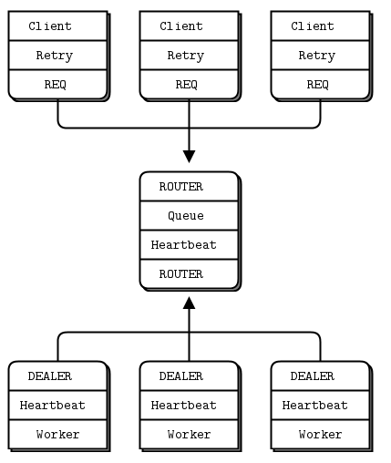

# ZeroMQ-RFC-Implementation
Implement ZeroMQ RFC by modern C++
### 6. PPP - Paranoid Pirate Protocol
* RFC - [https://rfc.zeromq.org/spec/6/](https://rfc.zeromq.org/spec/6/)
* [Document detail](https://zguide.zeromq.org/docs/chapter4/#Robust-Reliable-Queuing-Paranoid-Pirate-Pattern)  
* Architecture  
  
  
### 7. MDP - Majordomo Protocol
* RFC - [https://rfc.zeromq.org/spec/7/](https://rfc.zeromq.org/spec/7/)
* [Document detail](https://zguide.zeromq.org/docs/chapter4/#Service-Oriented-Reliable-Queuing-Majordomo-Pattern)  
  
    
### 8. MMI - Majordomo Management Interface
* RFC - [https://rfc.zeromq.org/spec/8/](https://rfc.zeromq.org/spec/8/)
* [Document detail](https://zguide.zeromq.org/docs/chapter4/#Service-Discovery)  
  
### 9. TSP - Titanic Service Protocol
* RFC - [https://rfc.zeromq.org/spec/9/](https://rfc.zeromq.org/spec/9/)
* [Document detail](https://zguide.zeromq.org/docs/chapter4/#Service-Discovery)  
* Architecture  
  
  
### BSP - Binary Star Pattern
* RFC - TBD
* [Document detail](https://zguide.zeromq.org/docs/chapter4/#High-Availability-Pair-Binary-Star-Pattern)  
* Architecture  
  

### 10.FLP - Freelance Protocol
* RFC - [https://rfc.zeromq.org/spec/10/](https://rfc.zeromq.org/spec/10/)
* [Document detail](https://zguide.zeromq.org/docs/chapter4/#Brokerless-Reliability-Freelance-Pattern)  
* Architecture  
  

## Third parties
* [zeromq library](https://github.com/zeromq/libzmq)
* [C++ binding for zeromq](https://github.com/zeromq/zmqpp)
* [Boost Library](https://www.boost.org/)
* [JSON for modern C++](https://github.com/nlohmann/json)
* [SPDLOG C++ logging](https://github.com/gabime/spdlog)
* [Visual leak detector](https://kinddragon.github.io/vld/)
* [Guidelines Support Library](https://github.com/microsoft/GSL)
* [C++ formatting library](https://github.com/fmtlib/fmt)
* [C++ date library](https://github.com/HowardHinnant/date)
